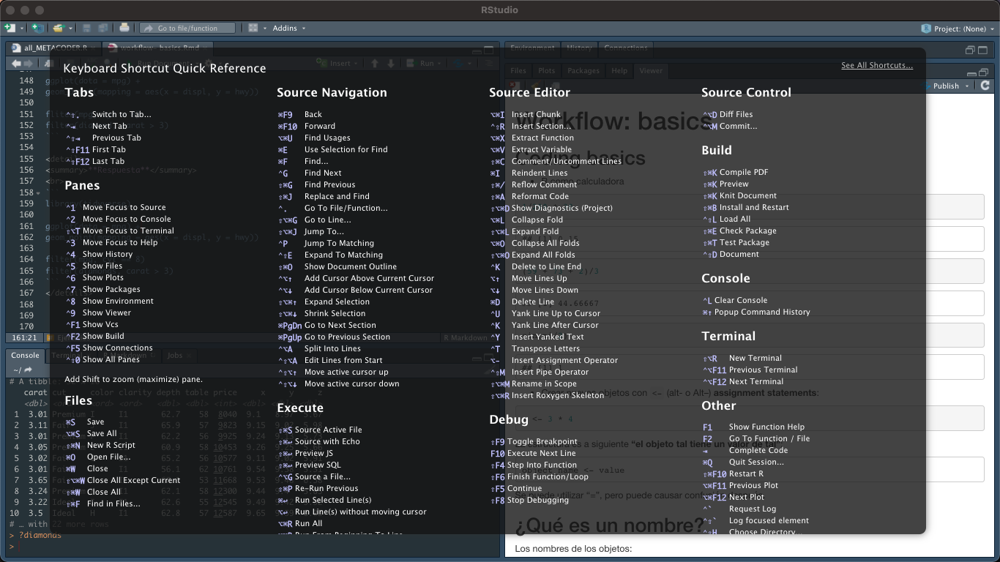

# Workflow: Basics
 
## Coding basics

* R como calculadora

```{r calculadora}
1/200 * 30
(59 + 73 + 2)/3
sin(pi/2)
```

* Crear nuevos objetos con `<-` (alt- o Alt--) **assignment statements**:
```{r objetos}
x <- 3 * 4
```

La estructura es a siguiente **"el objeto tal tiene un valor de tal"**:

```
object_name <- value
```

Se puede utilizar "=", pero puede causar confusión después.

## ¿Qué es un nombre?

Los nombres de los objetos:

* Pueden empezar con una letra
* Sólo pueden estar compuestos de letras, números, "_" y "."
* Prefefiblemente descriptivos (usar una convención). Autores recomiendan *snake_case*

```
i_use_snake_case
otherPeopleUseCamelCase
some.people.use.periods
And_aFew.People_RENOUNCEconvention
```

Se puede revisar el objeto escribiendo su nombre:

```{r}
x
```

**RStudio's completion facility:** (escrbir **'this'**, después presionar la tecla **Tab**)

```{r tab_ejemplo}
this_is_a_really_long_name <- 2.5
this
```

**¡¡¡Tuvimos un error!!!**
El objeto **this_is_a_really_long_name** debería tener un valor de 3.5 y no de 2.5. Podemos utilizar otro shortcut del teclado (**Cmd/Ctrl-↑**) :


El shortcut **Cmd/Ctrl-↑** enlista todos los comandos tipeados que empiezan con esa letra. Usa las flechas del teclado para navegar, después presiona **Enter** para retipear el comando. Cambia 2.5 por 3.5 y vuélvelo a correr:

```
this(Cmd/Ctrl-↑) 
```

**Debemos ser precisos en las instrucciones que le damos a R. Los typos importan. Las mayúsculas o minúsculas importan**

```{r}
r_rocks <-  2 ^ 3
r_rock
R_rocks
```

## Llamando funciones

R tiene una larga colección de funciones incorporadas que se llaman de la siguiente manera:

```
function_name(arg1 = val1, arg2 = val2, ...)
```

Vamos a tratar usando `seq`, que hace secuencias de números.

Tipea `se` y aprieta la tecla `Tab`


El pop-up muestra las posibles opciones para completar. Especifica `seq()` agregando más (una "q"), o utiliza las flechas del teclado para buscar la función. El tooltip proporciona información sobre los argumentos de la función y su propósito. Si requerimos más ayuda, apretamos F1 para obtener todos los detalles en la sección de ayuda del panel de abajo a la derecha. 

```{r}
seq(1, 10)
```

R también te va a ayudar con las comillas:

```
x <- "hello world" 
```

Las comillas y los paréntesis **SIEMPRE** deben ir en pares. RStudio hace lo que puede para ayudarnos, pero es posible que al final nuestros signos no tengan par, si eso pasa, R nos va a mostrar un "+".

```
> x <- "hello 
+
```

El  **"+"** nos dice que R está esperando más input. Generalmente significa que olvidamos un " on ). Podemos agregar el par que falta o presionar `Esc`para salir de la expresión e intentar de nuevo. 

Cuando asignamos un objeto, no obtenos el valor, por lo que lo tenemos que volver a tipear.

```{r}
y <- seq(1, 10, length.out = 5)
y
```

Esta acción puede ser acortada si encerramos la asignación con paréntesis, lo que ocasiona que la asignación se imprima en la pantalla:

```{r}
(y <- seq(1, 10, length.out = 5))
```


## Ejercicios 

1. ¿Por qué este código no funciona?

```
my_variable <- 10
my_varıable
```

<details>
<summary><b>Respuesta</b></summary>
<br>
Tiene un typo, una i sin punto
</details>


2. Modifique cada uno de los siguientes comandos R para que se ejecuten correctamente:


```
library(tidyverse)

ggplot(dota = mpg) +
geom_point(mapping = aes(x = displ, y = hwy))

fliter(mpg, cyl = 8)
filter(diamond, carat > 3)
```

<details>
<summary><b>Respuesta</b></summary>
<br>
 
```
library(tidyverse)

ggplot(data = mpg) +
geom_point(mapping = aes(x = displ, y = hwy))

filter(mpg, cyl == 8)
filter(diamonds, carat > 3)
```
</details>


3. Presiona `Alt-Shift-K`, ¿qué pasa? ¿cómo podemos llegar al mismo lugar usando los menus?

<details>
<summary><b>Respuesta</b></summary>
<br>


Podemos llegar ahí: **Tools > Keyboard Shortcuts Help**
</details>
