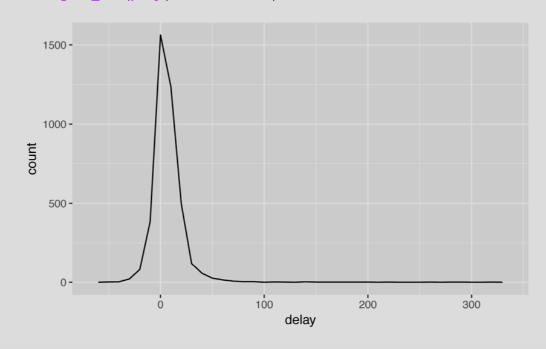
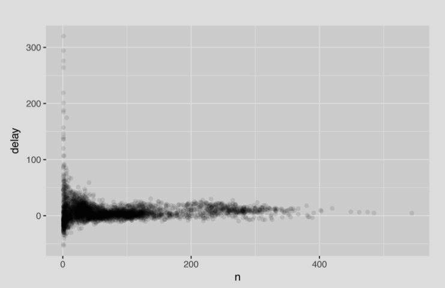
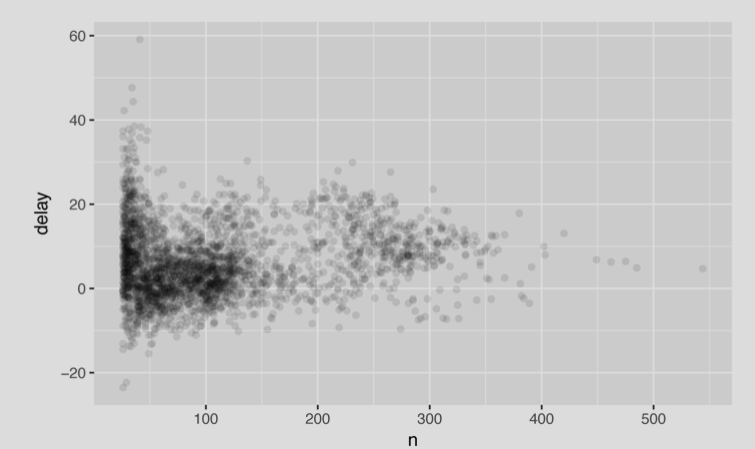
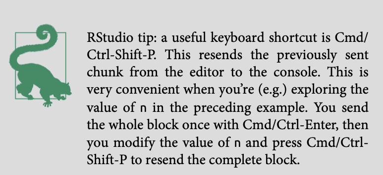

# Transformación de datos con dplyr


* La **visualización** es una herramienta importante para la geración del conocimiento. 
* Es raro tener los datos en la forma exacta en la que la necesitamos.
* Generalmente necesitamos crear nuevas variables, generar resúmenes de nuestros datos o reordenar las observaciones para trabajar con los datos de una manera más fácil. 


En este capítulo vamos a ver **cómo transformar los datos utilizando la paquetería *dplyr.***

## Prerequisitos


```
library(nycflights13)
library(tidyverse)
```

## nycflights13

* Esta data frame contiene la información de los 336,776 vuelos que despegaron de la ciudad de Nueva York en el año 2013.
* Proviene de la US Bureau of Transportation Statistics.
* Para acceder a la información del set de datos: `?flights'.

```
flights
```

1.  Es un *tible*. Un *tible* son básicamente data frames, pero un poco tuneadas para trabajar con ellas de manera más sencilla en los paquetes incluídos en el *tidyverse*.

2. También podemos notar las abreviaturas que están arriba de los nombres de las columnas. Este nombrecito describe el tipo de cada variable:

> * `int` para valores enteros
> * `dbl` para ¿dobles? o números reales.
> * `chr` para vectores de caracteres o cadenas.
> * `dttm` para fecha y hora (una fecha + la hora)

Hay otros tipos comúnes de variables que no se utilizaron en este dataset, pero los vamosa encontrar después en este libro.

> * `lgl` para valores logicos, vectores que sólo contienen TRUE o FALSE.
> * `fctr` para factores, que R utiliza para representar variables categóricas con valos posibles fijos,
> * `date` para fechas. 

## dplyr Basics

1. Seleccionar observaciones por sus valores (`filter()`)
2. Reordenar filas (`arrange()`)
3. Seleccionar variables por sus nombres (`select()`)
4. Crear nuevas variables con funciones de variables existentes (`mutate()`)
5. Colapsar varios valores en un solo resumen (`summarize()`)

Todas estas funciones se pueden utilizar en conjunto con `group_by()` para trabajar en grupo por grupo. ** Estas 6 funciones 'proporcionan los verbos para un lenguaje de manipulación de datos'.

Todos los *verbos* funcionan de manera similar:

1. El primer argumento es un data frame.
2. Los argumentos subsecuentes describen *qué hacer con el data frame*, usando los nombres de las variables (sin "").
3. El resultado es una nueva dataframe.

Estas propiedades juntas hacen que sea fácil encadenar varios pasos simples para lograr un resultado complejo.

## Filtrar columnas con `filter()`

* `filter()` permite obtener subconjuntos de las observaciones basados en sus valores.
* El primer argumento es el nombre del dataframe.
* El segundo (y subsecuentes) argumento son las expresiones que filtran el dataframe. 

Por ejemplo, podemos seleccionar lo vuelos del 1º de enero:

```
filter(flights, month == 1, day == 1)
```

* Cuando corremos esta línea, *dplyr* ejecuta el filtrado y regresa una nueva dataframe. Las funciones de *dplyr* *NUNCA* modifican sus inputs, por lo que si deseamos guardar el resultado, hay que utilizar el operador de asignación `<-`.

```
jan1 <- filter(flights, month == 1, day == 1)
```

## Comparaciones
Para utilizar el filtrados de una manera eficiente, tenemos que saber cómo seleccionar las variables que queremos utilizando los **operadores de comparación**: **>, >=, <, <=, != (no igual), == (igual)**

**!** Podemos encontrar problemas al utilizar '=' en vez de '==' y al utilizarlo podemos encontrarnos problemas con los valores de punto flotante:

```
sqrt(2)^2==2
1/49*49==1
```

para solucionar esto podemos utilizar `near()` en vez de `==`:

```
near(sqrt(2) ^ 2, 2)
near(1/49*49,1)
```


## Operadores lógicos

Muchos argumentos en `filter()` están combinados con "y": "cada expresión debe ser verdadera(TRUE) para que una fila se incluya en la salida". Para otro tipo de combinaiones necesitamos utilizar operadores booleanos:

* "&" es "y"
* "|" es "o"
* "!" es "no"


El siguiente código encuentra todos los vuelos que despegaron en noviembre o diciembre:

```
filter(flights, month == 11 | month == 12)
```

El orden de los operadores no funciona como el inglés. No podemos escribir:

```
filter(flights, month == 11 | 12)
```

Esta expresión va a buscar lo que esté en 11 y 12, o sea, 1, o sea, va a regresar los vuelos de enero. Un atajo útil para este problema es `x %in% y`: Esto va a seleccionar cada fila en donde x sea uno de los valores en y:

```
nov_dec <- filter(flights, month %in% c(11, 12))
```

Algunas veces podemos simplificar subconjuntos complicados recordando la ley de De Morgan:

> !(x & y ) es lo mismo que !x | !y, y !(x | y) es lo mismo que !x y !y


Por ejemplo, si queremos encontrar vuelos que no fueron retrasados (en llegada o salida) por más de dos horas, podemos utilizar los siguientes dos filtros:

```
filter(flights, !(arr_delay > 120 | dep_delay > 120))
filter(flights, arr_delay <= 120, dep_delay <= 120)
```

Cuando empecemos a utilizar expresiones complejas con `filter()` hay que considerar hacer variable explícitas.

## Valores faltantes

Una característica importante de R que puede dificultar la comparación son los valores faltantes o *"NA"*. *"NA"* representa un vaor desconocido, por lo que los valores perdidos son "contagiosos" , casi cualquier operación que implique un valor desconocido, también será desconocida. 

Si queremos determinar si un valor es NA, utilizamos `is.na()`:

```
x <- NA
is.na(x)
```

`filter()` sólo incluye filas en los que la condición es VERDADER (TRUE). Excluye tanto FALSE  como NA. Si queremos conservar los NA, hay que pedirlo explícitamente:


```
df <- tibble(x=c(1, NA, 3))
filter(df, x > 1)
filter(df, is.na(x) | x > 1)
```

### Ejercicios

1. Encuentra todos los vuelos que:

* a) Tengan un retraso en el aterrizaje de dos horas o más.

<details>
<summary><b>Respuesta</b></summary>


```
filter(flights, arr_delay >= 120)
```

</details>


* b) Volaron a Houston (IAH or HOU)

<details>
<summary><b>Respuesta</b></summary>

```
filter(flights, dest == "IAH" | dest == "HOU")
```

</details>

* c) Fueron operados por United, American o Delta

<details>
<summary><b>Respuesta</b></summary>

```
#Para ver nombres de las aerolíneas
airlines
filter(flights, carrier == "UA" | carrier == "AA" | carrier == "DL")
filter(flights, carrier %in% c("UA", "AA", "DL"))
```

</details>

* d) Despegaron en verano (julio, agosto y septiembre)

<details>
<summary><b>Respuesta</b></summary>

```
filter(flights, month %in% 7:9)
filter(flights, month >= 7, month <= 9)
```

</details>

* e) Aterrizaron más de dos horas tarde, pero no despegaron tarde

<details>
<summary><b>Respuesta</b></summary>

```
filter(flights, arr_delay > 120, dep_delay <= 0)

```

</details>


* f) Se retrasaron al menos una hora, pero recuperaron más de 30 minutos en vuelo.


<details>
<summary><b>Respuesta</b></summary>

```
filter(flights, dep_delay >= 60, dep_delay - arr_delay > 30)
```

</details>


* g) Despegaron entre la media noche y las 6 am.


<details>
<summary><b>Respuesta</b></summary>

```
filter(flights, dep_time <= 600 | dep_time== 2400)

filter(flights, dep_time %% 2400 <= 600)
```

</details>

2. Otra función útil de *dplyr* para filtrar es `between()` ¿Qué hace?, ¿Puedes simplificar el código para responder los ejercicios anteriores? 


<details>
<summary><b>Respuesta</b></summary>


La función `between(x, left, right)` equivale a: ` x >= left & x <= right.

De las preguntas anteriores, podemos simplificar el 'en el verano' `(month >= 7 & month <= 9)` utilizando la función `between()`.

```
filter(flights, between(month, 7, 9))
```

</details>

3. *Cuántos vuelos tienen un `dep_time`faltante? ¿Qué otras variables faltan? ¿Qué podrían representar estas filas?


<details>
<summary><b>Respuesta</b></summary>


```
filter(flights, is.na(dep_time))
```

También podemos ver eso con:

```
summary(flights)
```
8,255 vuelos. También falta la variable `arr_time`. Pueden ser vuelos cancelados.

</details>


4. ¿Por qué no falta NA ^ 0? ¿Por qué NA | TRUE no falta? ¿Por qué no faltan FALSE & NA? ¿Puedes averiguar la regla general? (¡NA * 0 es un contraejemplo complicado!)

<details>
<summary><b>Respuesta</b></summary>


* `NA ^ 0 == 1` porque para todos los valores numéricos x^0 = 1.
* `NA | TRUE` es `TRUE` porque "cualquier cosa" **o** TRUE es TRUE.
* `NA & FALSE` es `FALSE` porque "cualquier cosa **y** FALSE siempre es FALSE.

</details>

##  Arreglo de columnas con `arrange()`

* `arrange()`funciona de manera similar a `filter()`, a excepción de que en vez de seleccionar filas, cambia el orden. 
* Toma un dataframe y un set de nombres de columnas (o expresiones más complicadas) para ordenarlas. 

Podemos utilizar `desc()` para reordenar por columna en orden descendiente:

```
arrange(flights, desc(arr_delay))
```

Los valores faltantes siempre van a ser ordenados al final:

```
df <- tibble(x= c(5, 2, NA))
arrange(df, x)
arrange(df, desc(x))
```

### Ejercicios


1. ¿Cómo podemos utilizar `arrange()` para ordenar todos los valores faltantes al principio?

<details>
<summary><b>Respuesta</b></summary>

```
arrange(flights, desc(is.na(dep_time)), dep_time)
```

</details>

2. Ordenar los vuelos para encotrar aquellos con mayor retraso. Encuentra los vuelos que se retrasaron más.

<details>
<summary><b>Respuesta</b><summary>

```
arrange(flights, desc(dep_delay))
```
</details>

3. Ordena los vuelos para encontrar los más rápidos.

<details>
<summary><b>Respuesta</b><summary>

```
arrange(flights, desc(distance / air_time))
```

</details>

4. ¿Cuáles vuelos viajaron más?, ¿Cuáles vuelos viajaron menos?

<details>
<summary><b>Respuesta</b></summary>

Los que viajaron más:
```
arrange(flights, desc(distance))
```

Los que viajaron menos:
```
arrange(flights, distance)
```

</details>

## Seleccionando columnas con `select()`

No es poco común tener sed de datos con cientos o miles de variables. La función `select()` nos permite seleccionar rápidamente las columnas de acuerdo a su nombre.

Seleccionar columnas por nombre:

```
select(flights, year, month, day)
```

Seleccionar todas las columnas entre día y año:

```
select(flights, year:day)
```

Seleccionar todas las columnas, excepto aquellas de año a día:

```
select(flights, -(year:day))
```

Hay funciones útiles que se pueden utilizar con `select()`:

* `starts_with("abc")`encuentra losnombres que empiezan con "abc"
* `ends_with("xyz")` encuentra los nombres que terminan con xyz.
* `contains()`encuentra los nombres que incluyen "ijk"
* `matches("(.)\\1)"` selecciona variables que concuerdan con una expresión regular. Esta en específico, encuentra cualquier variable que contiene caracteres repetidos. 
* `num_range("x", 1:3)`encuentra x1, x2 y x3.


`select()`se puede utilizar para ambiar el nombre de las variables. pero rara vez es útil, porque elimina todas las variables que no se mencionan explícitamente. En su lugar, podemos utilizar `rename()`que es una variante de `select()`que mantiene todas las variables que no se mencionan explícitamente. 

```
rename(flights, tail_num = tailnum)
```

Otra opción es utilizar `select() en conjunto con `everything(). Esto es útil si tenemos un montón de variables que queremos mover al inicio del dataframe:

```
select(flights, time_hour, air_time, everything())
```

### Ejercicios

1. Lluvia de ideas de las maneras posibles de seleccionar `dept_time`, `dep_delay`, `arr_time` y `arr_delay` flights.

<details>
<summary><b>Respuesta</b></sumary>

```
select(flights, dep_time, dep_delay, arr_time, arr_delay)
select(flights, "dep_time", "dep_delay", "arr_time", "arr_delay")
select(flights, 4, 6, 7, 9)
select(flights, all_of(c("dep_time", "dep_delay", "arr_time", "arr_delay")))
select(flights, any_of(c("dep_time", "dep_delay", "arr_time", "arr_delay")))

# hacer una variable, variable y ponerla en select
variables <- c("dep_time", "dep_delay", "arr_time", "arr_delay")
select(flights, all_of(variables))

select(flights, starts_with("dep_"), starts_with("arr_"))

#Regex
select(flights, matches("^(dep|arr)_(time|delay)$"))

#otro variables y bang-bang operator
variables <- c("dep_time", "dep_delay", "arr_time", "arr_delay")
select(flights, !!variables)

#otro-otro variables y bang-bang-bang
variables <- c("dep_time", "dep_delay", "arr_time", "arr_delay")
select(flights, !!!variables)

```


</details>


2. ¿Qué pasa si incluímos el nombre de la variable cuando llamamos `select()`?

<details>
<summary><b>Respuesta</b></summary>

`select()` ignora la duplicación. Las variables duplicadas solo se incluyen una vez, en la primera ubicación en la que aparecen. La función `select()` no genera un error o advertencia ni imprime ningún mensaje si hay variables duplicadas.

</details>


3. ¿Qué hace la función `one_off()`?, ¿Por qué puede ser útil en conjunto con este vector?

```
 vars <- c(
          "year", "month", "day", "dep_delay", "arr_delay"
)
```

<details>
<summary><b>Respuesta</b></summary>
La función `one_of()` selecciona variables con un vector de caracteres en lugar de nombres de variable sin comillas. Esta función es útil porque es más fácil generar vectores de caracteres con nombres de variables que generar nombres de variables sin comillas, que son más fáciles de escribir.

```
vars <- c("year", "month", "day", "dep_delay", "arr_delay")
select(flights, one_of(vars))
```

* En las versiones más recientes de **dplyr**, `one_of()` ha quedado obsoleto, en su lugar, se utilizan las funciones: `all_of()` y `any_of()`. Estas funciones se comportan de manera similar si todas las variables están presentes en el set de datos.

</details>

4. ¿Sorprende el resultado de ejecutar el siguiente código? ¿Cómo tratan 'helpers' seleccionados el caso de forma predeterminada? ¿Cómo se puede cambiar ese valor predeterminado?

```
select(flights, contains("TIME"))
```

<details>
<summary><b>Respuesta</b></summary>

* El comportamiento predeterminado de contains () es ignorar las mayúsculas y  minúsculas.
* Para cambiar el comportamiento, agregue el argumento `ignore.case = FALSE`.

```
select(flights, contains("TIME", ignore.case = FALSE))
```

</details>


## Agrega nuevas variables con `mutate()

En vez de seleccionar sets de columnas existentes, generalmente es más útil agregar nuevas columnas que son funciones de columnas existentes. Esto lo podemos hacer con `mutate()``

`mutate()` siempre agrega columnas al final del set de datos.

```
flights_sml <- select(flights,
  year:day,
  ends_with("delay"),
  distance,
  air_time)


mutate(flights_sml,
  gain = arr_delay - dep_delay,
  speed = distance / air_time * 60)

```


Se pueden referir columnas que ya creamos:

```
mutate(flights_sml,
  gain = arr_delay - dep_delay,
  hours = air_time / 60,
  gain_per_hour = gain / hours)
```

Si sólo queremos conservar las nuevas variables, hay que utilizar `transmute()`

```
transmute(flights,
  gain = arr_delay - dep_delay,
  hours = air_time / 60,
  gain_per_hour = gain / hours)
```


## Funciones de creación útiles

Exiten muchas funciones para crear nuevas ariables que se pueden utilizar en conjunto con `mutate()`.

* *Operadores aritméticos* **"+","-","*","/","^"** Por ejemplo: `air_time / 60`, `hours*60+minute`, `x/sum(x)`, `y-mean(y)`
* *Modulares aritméticos* **%/%** (entero de la división) y **%%** (residuo.). Por ejemplo: 

En el set de datos `flights` podemos calcular las horas y minutos de `dep_time`:

```
transmute(flights,
  dep_time,
  hour = dep_time %/% 100,
  minute = dep_time %% 100)
```

* *Logs* `log()`, `log2()`, `log10()`: los logaritmos son una transformación increíblemente útil para tratar con datos de abarcan varios órdenes de magnitud. 

* *Offsets* `lead()` y `lag()`.

```
(x<- 1:10)
lag(x)
lead(x)
```

* *Agregados acumulativos y rodantes: R proporciona funcines para ejecutar sumas, productos, mínimos y máximos: `cumsum()`, `cumprod()`, `cummin()`, `cummax()` y **dplyr** proporciona `cummean()` para medios acumulativos. Si necesita agregados móviles (es decir, una suma calculada en una ventana móvil), podemos probar la paquetería **RccppRoll**.

```
x
cumsum(x)
cummean(x)
```

* *Comparaciones lógicas* **<, <=, >, >=, !=**
* **Rangos** `min_rank()`,  `row_number()`, `row_number()`, `dense_rank()`, `percent_rank()`, `cume_dist()`

### Ejercicios

1. `dep_time`y `sched_dep_time` son convenientes de observar, pero difíciles de calcular porque en realidad no son números continuos. Hay que convertirlos en una representación más conveniente del número de minutos desde la media noche.

<details>
<summary><b>Respuesta</b></summary>

```
flights_times <- transmute(flights,
  dep_time_mins = (dep_time %/% 100 * 60 + dep_time %% 100) %% 1440,
  sched_dep_time_mins = (sched_dep_time %/% 100 * 60 + sched_dep_time %% 100) %% 1440)

```
</details>

2.  Comparar `air_time`con `arr_time` - `dep_time`. ¿Qué se espera encontrar? ¿Qué se observa? ¿Qué se necesita para arreglarlo?

<details>
<summary><b>Respuesta</b></summary>

Se espera que `air_time` sea la diferencia entre las horas de llegada `arr_time`y de salida `dep_time`. En otras palabras, `air_time = arr_time - dep_time`.


```
flights_airtime <-
  mutate(flights,
    dep_time = (dep_time %/% 100 * 60 + dep_time %% 100) %% 1440,
    arr_time = (arr_time %/% 100 * 60 + arr_time %% 100) %% 1440,
    air_time_diff = air_time - arr_time + dep_time
  )
  
nrow(filter(flights_airtime, air_time_diff != 0))
```

`air_time != arr_time - dep_time`

Para arreglarlo se necesitaría convertir todos los tiempos a las mismas zonas horarias

</details>

3. Comparar `dep_time`, `sched_dep_time` y `dep_delay` ¿Cómo se esperaría que se relacionen esos tres números?


<details>
<summary><b>Respuesta></b><summary>

Se esperaría que la demora de salida (dep_delay) sea igual a la diferencia entre la hora de salida programada (sched_dep_time) y la hora de salida real (dep_time), dep_time - sched_dep_time = dep_delay.


</details>

4. Encontrar los 10 vuelos más retrasados usando una función de rango.

<details>
<summary><b>Respuesta</b><summary>

```
flights_delayed <- mutate(flights, 
                          dep_delay_min_rank = min_rank(desc(dep_delay)),
                          dep_delay_row_number = row_number(desc(dep_delay)),
                          dep_delay_dense_rank = dense_rank(desc(dep_delay)))

flights_delayed <- filter(flights_delayed, 
                          !(dep_delay_min_rank > 10 | dep_delay_row_number > 10 |
                              dep_delay_dense_rank > 10))
                              
flights_delayed <- arrange(flights_delayed, dep_delay_min_rank)

print(select(flights_delayed, month, day, carrier, flight, dep_delay, 
             dep_delay_min_rank, dep_delay_row_number, dep_delay_dense_rank), 
      n = Inf)


```
</details>

5. ¿Qué regresa 1:3 + 1:10? ¿Por qué?

<details>
<summary><b>Respuesta</b></summary>

El código regresa:

```
#> Warning in 1:3 + 1:10: longer object length is not a multiple of shorter object length
```

Al sumar dos vectores, R recicla los valores del vector más corto para crear un vector de la misma longitud que el vector más largo. El código también genera una advertencia de que el vector más corto no es un múltiplo del vector más largo. Se genera una advertencia, ya que cuando esto ocurre, a menudo no es intencional y puede ser un error.


</details>


6. ¿Qué funciones trigonométricas proporciona R?

<details>
<summary><b>Respuesta</b></summary>
?Trig
</details>


## Resúmenes agrupados con `summarize()`

La función `summarize()` colapsa toda la data frame a una simple columna:


```
summarize(flights, delay = mean(dep_delay, na.rm = TRUE))
```

Al utilizar `summarize()`en conjunto con `group_by` podemos analizar grupos individuales, Por ejemplo, si utilizamos exactamente el código anterior a un data frame por grupo, obtenemos el promedio de retraso por fecha:

```
by_day <- group_by(flights, year, month, day)
summarize(by_day, delay = mean(dep_delay, na.rm = TRUE))
```

## Combinando múltiples operaciones con **Pipe**

Imaginemos que queremos explorar la relación entre la distancia y el retraso promedio para cada ubicación. Usando lo revisado hasta ahora, tal vez escribiríamos un código como éste:

```
by_dest <- group_by(flights, dest)
delay <- summarize(by_dest,
  count = n(),
  dist = mean(distance, na.rm = TRUE),
  delay = mean(arr_delay, na.rm = TRUE) )
  delay <- filter(delay, count > 20, dest != "HNL")

```

Para preparar este grupo de datos:

1. Primero hay que agrupar los vuelos por destino.
2. Resumir la distancia, el retraso promedio y el número de vuelos.
3. Filtrar para remover los puntos que generan ruido y el aeropuerto de Honolulu, que está casi al doble de distancia del aeropuerto más cercano.

Este código puede resultar frustrante de escribir porque tenemos que darle a cada data frame intermedio un nombre, aunque en realidad no nos importan. Hay una manera de abordar el mismo problema, con el **pipe**

```
delays <- flights %>%
  group_by(dest) %>%
  summarize(count = n(),
  dist = mean(distance, na.rm = TRUE),
  delay= mean(arr_delay, na.rm = TRUE)) %>%
  filter(count > 20, dest != "HNL")
```

Esto se enfoca en la transformación, no en lo que está siendo transformado, lo que hace el código más fáci de leer:

> Agrúpalo, después resúmelo, después filtralo.

Tras bambalias, ** x %>% f(y)** se transforma en **f(x, y)**, y **x %>% f(y) %>% g(z)** se transforma en **g(f(x, y),z)** y así. 

## Valores Faltantes

Todas las funciones de agregación tienen el argumento `na.rm`que elimina todos los valores faltantes antes de hacer los cálculos correspondientes.

```
flights %>%
group_by(year, month, day) %>%
summarize(mean = mean(dep_delay, na.rm = TRUE))
```


## Contadores

Siempre que se estén haciendo adiciones, es una buena idea agregar un `count(n())`o un contador de nonmissing values `(sum(!is.na(x)))`. De esta manera podemos checar que no estamos generando conclusiones basados en muy pequeños set de datos. Por ejemplo, mirando los aviones (identificados por `tail number`) que tiene el promedio más alto de retrasos:

```
not_cancelled <- flights %>%
      filter(!is.na(dep_delay), !is.na(arr_delay))

not_cancelled %>%
      group_by(year, month, day) %>%
      summarize(mean = mean(dep_delay))

delays <- not_cancelled %>%
  group_by(tailnum) %>%
  summarize(
    delay = mean(arr_delay)
    )

ggplot(data = delays, mapping = aes(x = delay)) +
      geom_freqpoly(binwidth = 10)    
    
```



¡Wow, hay algunos aviones que tienen una demora promedio de 5 horas (300 minutos)!

En realidad, la historia tiene un poco más de matices. Podemos obtener más información si dibujamos un diagrama de dispersión del número de vuelos frente al retraso promedio:

```
delays <- not_cancelled %>%
      group_by(tailnum) %>%
      summarize(
delay = mean(arr_delay, na.rm = TRUE),
n=n() )

ggplot(data = delays, mapping = aes(x = n, y = delay)) +
      geom_point(alpha = 1/10)
```



No es de extrañar que exista una variación mucho mayor en la demora promedio cuando hay pocos vuelos. La forma de esta gráfica es muy característica: siempre que grafique una media (u otro resumen) frente al tamaño del grupo, se observará que la variación disminuye a medida que aumenta el tamaño de la muestra.

Al observar este tipo de gráfico, a menudo es útil filtrar los grupos con el menor número de observaciones, para que se pueda observar más del patrón y menos de la variación extrema en los grupos más pequeños. 


```
delays %>%
      filter(n > 25) %>%
      ggplot(mapping = aes(x = n, y = delay)) +
        geom_point(alpha = 1/10)
```






## Funciones de resúmenes útiles

* Medidas de localización

```
not_cancelled %>%
      group_by(year, month, day) %>%
      summarize(
        # average delay:
avg_delay1 = mean(arr_delay),
# average positive delay:
avg_delay2 = mean(arr_delay[arr_delay > 0])
)
```
* Medidas de dispersión `sd(x)`, `IQR(x)`, `mad(x)`
* Medidas de rango `min(x)`, `quantile(x, 0.25)`, `max(x)
* Medidas de posición Measures of position `first(x)`, `nth(x, 2)`, `last(x)`

## Agrupamiento por múltiples variables

Cuando se agrupa por múltiples variables, cada resumen elimina un nivel de la agrupación. Eso hace que sea fácil acumular progresivamente un data set:

```
daily <- group_by(flights, year, month, day) 
(per_day <-summarize(daily,flights=n()))
(per_month <- summarize(per_day, flights = sum(flights)))
(per_year <- summarize(per_month, flights = sum(flights)))
```


# Desagrupar

Si se necesita eliminar el agrupamiento y regresar a las operaciones en los datos desagrupados, se puede utilizar `ungroup()`:


```
daily %>%
  ungroup() %>% # no longer grouped by date
  summarize(flights = n()) 
```

